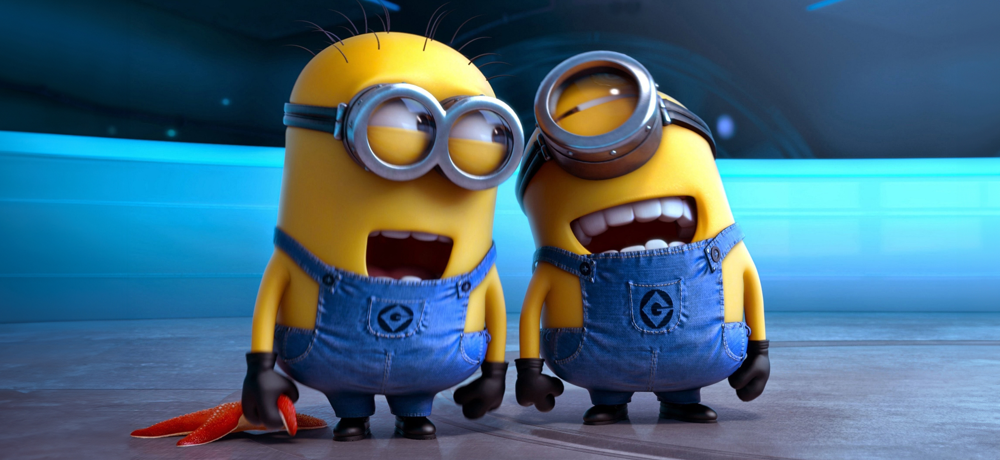

# web6405lednikka
**ФИО:** Ледник Кирилл Андреевич  
**Группа:** 6405-010302D  
**Научный руководитель:** Сергеев Владислав Викторович  
**Тема диплома:** «Разработка алгоритмов рекурсивной обработки изображений в скользящем окне»

---

**Любимая цитата:**  
*«Каждый человек имеет право на второй шанс. Кто-то заслужил этот шанс долгой и кропотливой работой, некоторым сама жизнь даёт второй шанс. Кто-то хочет получить второй шанс, хотя сам боится себе в этом сознаться — в общем, жизнь полна сюрпризов!»*  
*— Максим Лавров*

---

#(lab2) Многостраничный веб-сайт: Обработка изображений

Проект представляет собой многостраничный сайт, посвящённый алгоритмам обработки изображений (фильтрация, скользящее окно). Сайт выполнен с использованием HTML и CSS.

## Структура

- `index.html` — Главная страница.
- `gaussian_filter.html` — Описание гауссовской фильтрации.
- `filter_usage.html` — Применение фильтра Гаусса (таблица).
- `sliding_window.html` — Скользящее окно.
- `styles.css` — Стили для сайта.

# Lab3

**Lab3** содержит набор функций, реализующих требуемый функционал на языке JavaScript. Эти функции предназначены для выполнения задач в рамках лабораторной работы и демонстрируют использование современных подходов к программированию.
